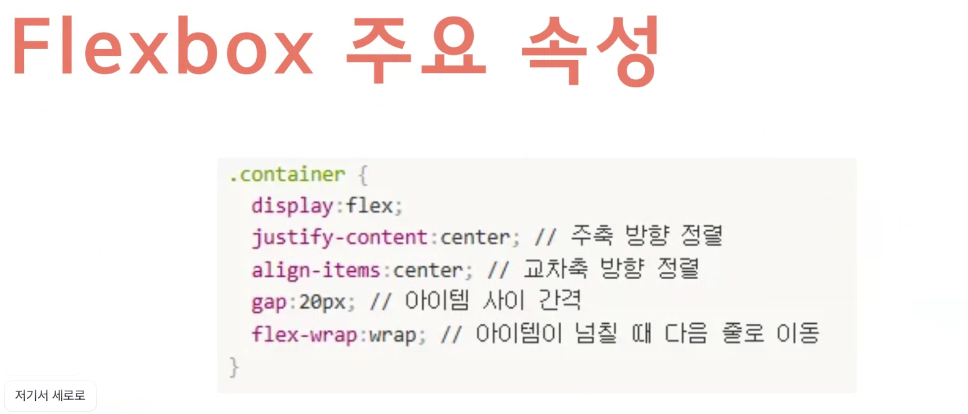

### inline 요소
- 내용만큼 공간을 차지하는 녀석
    - a, span, em,

### 포지션이란?
- 요소의 위치를 조절하는 속성
- 항목들
    - static
        기본값
    - relative
        원래 위치를 기준으로 이동 
        해당 위치에서 이동해도 원래 있던 자리의 권리를 가지고 있음
    - absoulte
        기준이 되는 부모를 기준으로 이동
        부모를 기준으로 이동하고, 원래 자리에 대한 권리가 사라짐
        무조건 블록 요소로 되어 크기 지정을 안하면 콘텐츠만큼 가로폭이 줄어듬
    - fixed 
        화면을 기준으로 고정 (부모 요소와 상관없음)
        페이지를 아무리 내려도 그 브라우저창 뷰포인트 기준으로 고정됨
        ex. 네비게이션바. 구매하기. 맨위로이동, 챗본 등
    - sticky 
        스크롤 위치에 따라 고정. 조건부 고정
        원래는 평범하게 취급되다가 스크롤이 특정 위치에 도달하면 fixed 처럼됨
        ex. top 0으로 설정하면 top0에 도달하기 전까지 일반. 이후 fixed
        relative처럼 원래 자리를 차지하고 있음.
        부모 요소의 높이가 자식 요소보다 커야 함. 부모영역 안에서만 고정됨.
    - float 
        이미지를 왼쪽에 두고 텍스트가 옆으로 흐르게 만들때 사용
        자주 사용하지는 않는 개념
    - flex
        부모요소 안의 자식 요소들을 한방향으로 정렬할 때 사용
        한 방향 배치에 강함
        가로로 길게 부모요소가 있고 거기에 박스들이 가로로 들어가게 함
        
    - grid
        행과 열을 기준으로 요소를 배치하는 레이아웃 방식

박스모델
박스사이징 - bodrer-box 로 크기 계산을 쉽게 만들기
display: block / inline / inline-block / none
posision: relative / absolute / fixed / sticky / float / clear / fletbox / grid